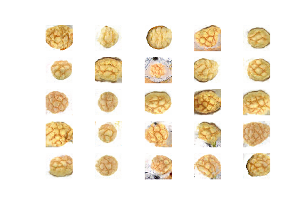
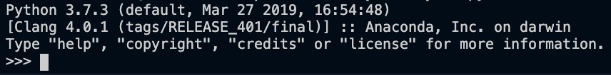

# 少ない枚数でもお手軽GAN



## 参考
[画像認識で「綾鷹を選ばせる」AIを作る](https://qiita.com/tomo_20180402/items/e8c55bdca648f4877188)
[GANについて概念から実装まで　～DCGANによるキルミーベイベー生成～](https://qiita.com/taku-buntu/items/0093a68bfae0b0ff879d)

## 前提
* pythonのインストールは済ませておこう  
  (python3のパスが通ればOK)



## 1. pythonの仮想環境を作ろう
ENV_NAMEには自分の好きな名前を入れよう

```
python3 -m venv ENV_NAME
```

ENV_NAMEフォルダが作られる

## 2. 仮想環境の起動
MacかWindowsかで分かれます  

MacOS
```
$ source ENV_NAME/bin/activate
```

Windows
```
> ENV_NAME¥Scripts¥activate
```
## 3. ライブラリのインストールをしよう

```
pip install -r "requirements.txt"
```

## 4. GANで生成したいものの画像をdataフォルダの中に入れよう
複数あるといいかも。10枚あればOK?

## 5. 画像10枚じゃたりないから増やそう

```
python data_generate.py
```
そのままだと一枚の画像につき5000枚生成します。
トータル枚数が60000~100000枚になるように生成してみましょう  
(128×128の画像なのでそこまで重くないと思います。)

## 6. 生成開始！

```
python gan.py
```
そのままだと200000ステップ学習します。1000学習ごとに画像生成してgendataのlatentに中に保存します。
